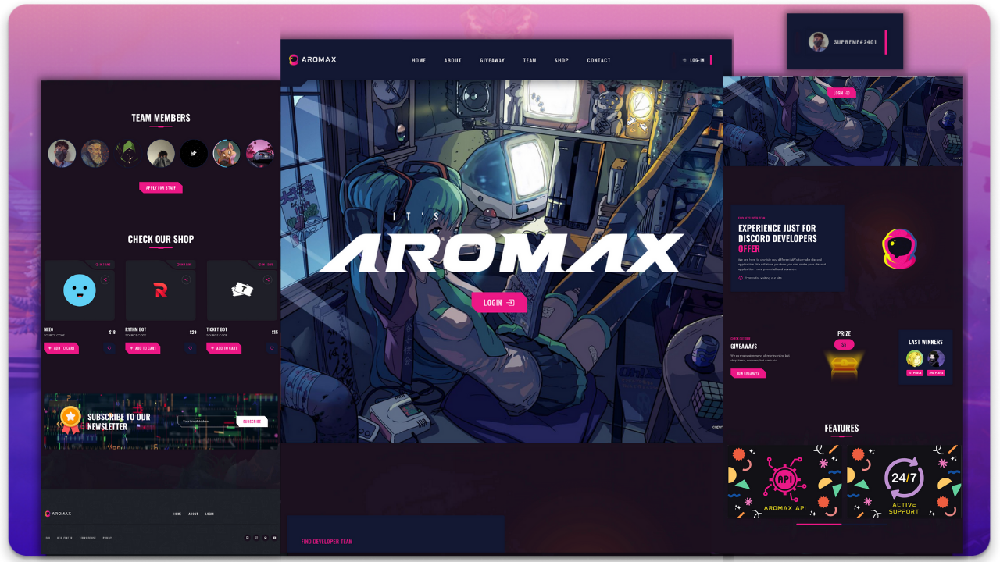

<div align="center">
  
  

  <h2 align="center">Painel do Servidor do Discord</h2>

  Este é um modelo totalmente responsivo de painel para servidor/bot do Discord. Aqui você também pode ver um sistema de login.

</div>

<br>

## Instalação

- Clone o repositório:
```
git clone https://github.com/diwasatreya/Discord-Server-Dashboard.git
```

- [Executar no Replit](https://repl.it/github/diwasatreya/Discord-Server-Dashboard)

- Após clonar, digite no Shell/Terminal:
```js
npm install
```

- Crie um arquivo `.env` (Segredo de Ambiente no Replit)
```
TOKEN=XXXXXXXXXX
DB=XXXXXXXXXXXXX
```

- Preencha o arquivo `config.json`

## Portal de Desenvolvedores do Discord
Adicione `https://dominio/` & `https://dominio/auth/login` na URL de redirecionamento OAuth2 da aplicação.

## Adicionando APIs
Vá até `routes/api.js` e adicione seu código de API.

<div align="center">
  <br>
  <h3> Dê uma estrela para o projeto </h3>
  <p> Me siga no GitHub e Twitter </p>
 
</div>